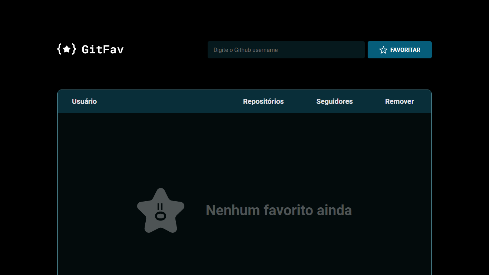
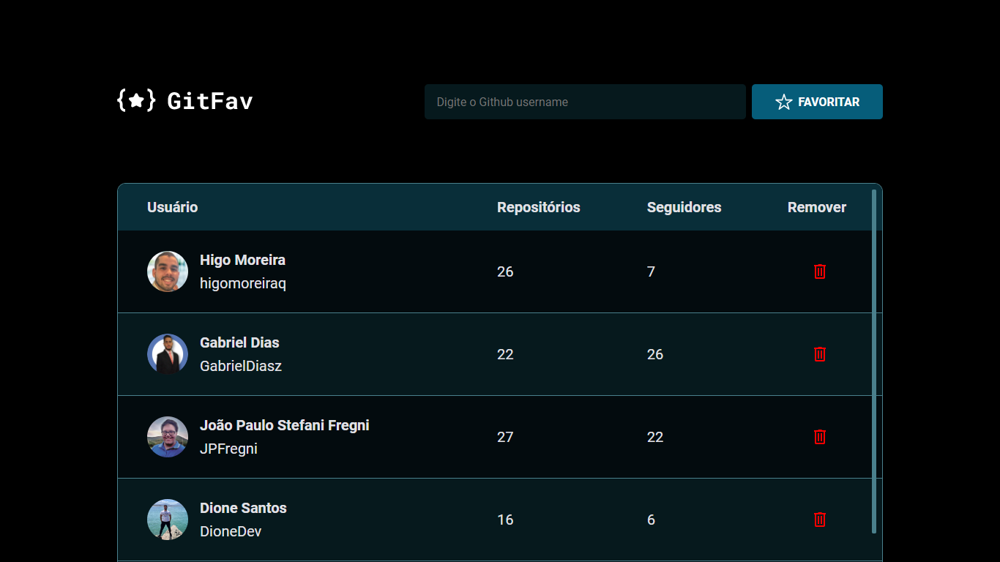

# git-fav ⭐️

Challange 06 | Create a GitHub favorites page, being able to add or remove favorites, showing the user, the number of repositories and followers of the favorite profiles.

The application starts reset, with the list of users empty, being informed on the screen that there are no favorites yet.

If the user tries to add a profile that does not exist, he will receive an alert message stating that the user was not found. If you try to insert a repeated profile, you will receive an alert message informing you that the user is already registered. If you want to remove one of the favorite profiles, you will be asked to confirm whether you really want to delete the selected user.

Home page without any favorite profile:

Application with registered favorite profiles:

